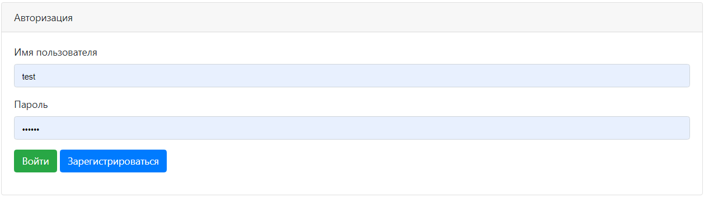
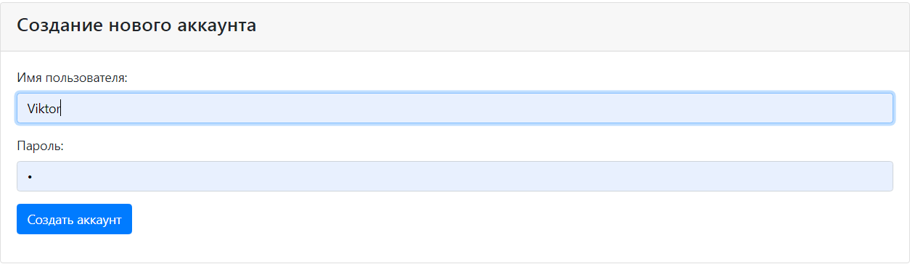
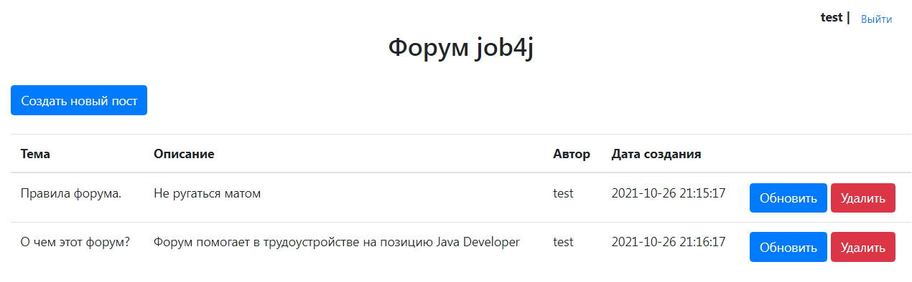
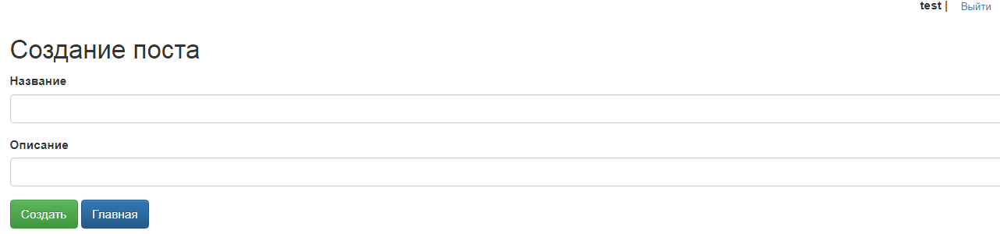
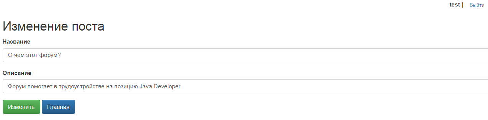

# job4j_forum

## О проекте
#### Сервис предоставляет возможности классического форума.

## Стек
* Back-end
    * Java 15
    * Spring (Boot, MVC, Data, Security)
    * Apache Tomcat
    * Postgres
    * Maven

* Front-end
    * JS
    * Jsp
    * Jstl
    * Bootstrap

## Возможности
  * Авторизация и регистрация
  * Создание постов
  * Редактирование постов
  * Просмотр созданных постов

## Демо

### Авторизация

### Регистрация

### Главная страница

### Создание поста

### Редактирование поста

## Контакты
Если у вас остались вопросы, вы можете связаться со мной.
* Telegram: @vbgrishin